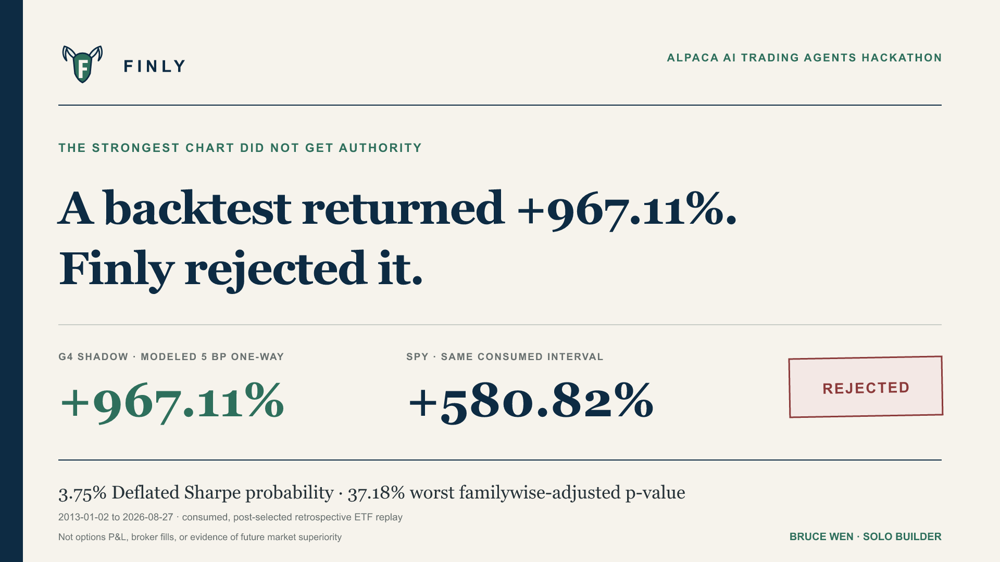

# Finly



**Finly shows its work before it trades.**

We built Finly to answer a simple question: can an AI research a market idea without getting unchecked control of the account?

Finly reads current market evidence, explains what it sees, builds a defined-risk trade, checks the numbers, and then sends the order to Alpaca paper trading—or stops it. The model can help interpret the evidence. Code sets the position, maximum loss, and every broker field.

[Open Finly](https://owlsowo.github.io/finly-bot/) · [Watch the live account](https://owlsowo.github.io/finly-bot/#live) · [Try the decision demo](https://owlsowo.github.io/finly-bot/#controls) · [Read the one-page proposal](public/judge/Finly_Judge_Brief.pdf) · [Open the mathematical note](public/judge/Finly_Technical_Proposal.pdf) · [Read the engineering appendix](public/judge/Finly_Engineering_Appendix.pdf) · [View the deck](public/judge/Finly_Consulting_Deck.pdf)

## The result that made us build it

In a cost-adjusted historical simulation from January 2013 through August 2026, Finly's G4 strategy turned a modeled **$10,000 into $106,711**. SPY reached **$68,082** over the same dates—a **$38,629 difference in ending wealth**.

We then fixed an industry version of the rule and ran it across 21,218 earlier market days from Kenneth French's public archive. It annualized at **13.37% versus 9.48% for the market**, stayed ahead across all 21 monthly rebalance dates we tested, and kept a positive edge when modeled trading costs were increased fivefold.

We chose G4 for a public paper test after reviewing those historical results. That was a human operator's competition decision, not a research-gate promotion or a promise of outperformance. The [deployment record](public/data/competition-deployment-record.json) fixes the scope and timing: QQQ as the core, the three strongest sector funds by twelve-to-six-month momentum, and a small cash reserve.

## Here's how it works

1. **Read the market.** Finly gathers time-stamped market, options, event, news, and prediction-market evidence.
2. **Form a view.** Qwen3-32B reviews the public news and explains what supports or weakens the idea.
3. **Build the trade.** Code—not the model—sets direction, size, expiration, strikes, and maximum loss.
4. **Try to break it.** Finly removes sources, changes important inputs, and checks the payoff and broker fields.
5. **Trade or stop.** The system either prepares one exact Alpaca paper order or leaves the account untouched.

In the public options demo, Finly built a one-contract SPY debit spread with an exact **$366 maximum loss** and **$634 maximum gain**. The case passed **4/4 source-removal checks** and **32/32 input perturbations** before the paper-order plan was prepared. Switch to conflicting evidence on the website and the same workflow stops before taking exposure.

## Running live on Alpaca paper trading

Finly runs in the cloud against a dedicated, verified **$100,000 Alpaca paper account**. The runner uses Alpaca's official MCP server, keeps the trading code pinned to an audited Git revision, saves enough state to recover safely after a restart, and reads every result back from Alpaca before moving on.

The [public dashboard](https://owlsowo.github.io/finly-bot/#live) shows sanitized account state, current positions, recent decisions, and paper-account P&L from the $100,000 baseline without exposing credentials or the raw account identifier. The forward SPY comparison is scored separately at a shared timestamp. The laptop does not need to stay awake.

At the first closing bell, the paper account was **up $95.32** while the same-$100,000, same-timestamp SPY price benchmark was **down $57.99**. That put Finly **$153.31 ahead of SPY** at exactly 4:00 p.m. ET, after 15 broker fills and with zero external cashflows. The [read-only measurement](public/data/competition_forward_profit_2026_08_31.json) preserves the score independently of the changing after-hours account mark.

## Check the numbers

The public test suite covers reproduction of the operator-selected, frozen G4 signal, option payoff arithmetic, position limits, quote freshness, account checks, lost acknowledgements, restart recovery, encrypted state, broker-field translation, and the rules used to score the live account. These implementation checks do not turn the historical simulation into a forward performance claim.

```bash
npm install
npm test
npm run build
```

Current public result: **809 tests run, 807 passed, 0 failed, 2 skipped.**

Useful focused checks:

```bash
npm run research:quant-extension-check
npm run economic:options-replay-check
npm run llama:decision-check
npm run verify
```

## Repository map

```text
lib/         strategy logic, options compiler, risk checks, and broker guards
research/    historical studies, frozen protocols, and forward measurement
scripts/     cloud runner, receipt checkers, model tools, and artifact builders
evidence/    redacted runtime records
fixtures/    aligned, conflicting, and boundary-test scenarios
src/         public product website and live dashboard
tests/       unit, integration, restart, statistical, and reporting tests
docs/        proposal, mathematical note, engineering appendix, submission copy, and operating notes
```

## Research and broker sources

The strategy draws on published work on [time-series momentum](https://doi.org/10.1016/j.jfineco.2011.11.003) and [volatility-managed portfolios](https://doi.org/10.1111/jofi.12513), plus [Kenneth French's public Data Library](https://mba.tuck.dartmouth.edu/pages/faculty/ken.french/data_library.html). The broker path follows Alpaca's documentation for [options trading](https://docs.alpaca.markets/us/docs/options-trading), [multi-leg orders](https://docs.alpaca.markets/reference/postorder), and [paper trading](https://docs.alpaca.markets/us/docs/paper-trading).

Finly is an educational paper-trading project. Historical simulations are not live results or promises of future returns, and options can lose their full premium.
